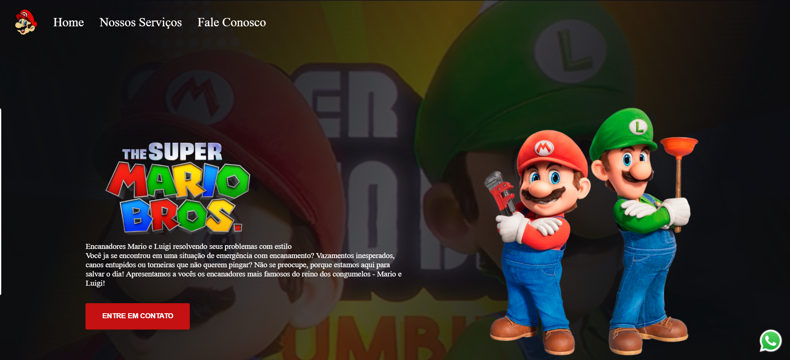
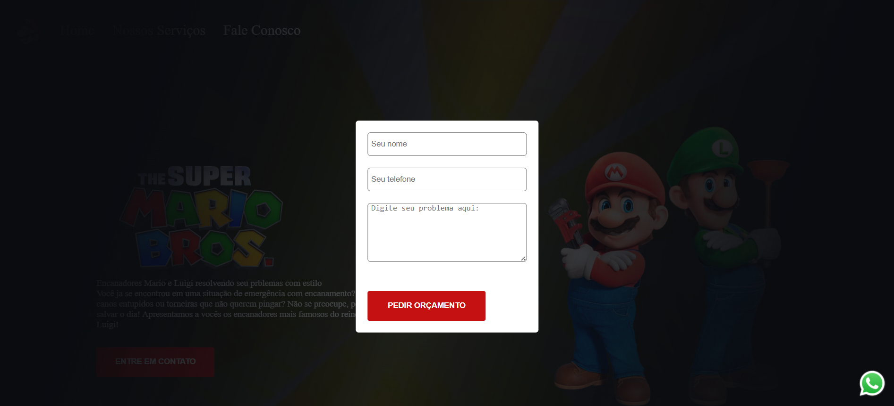

<h1>Este é um projeto meu feito em colaboração com o <a href="https://rodolfomori.com.br/">DevClub</a></h1>
 
 
<h1> Tecnologias utilizadas: </h1>
 
</>
</>
</>
 
<h1> 🏠 Página Inicial:</h1>
 
</>
 
 
<h1> 📩 Tela de Contato: </h1>
 
</>

<h4> Este projeto apresenta uma página inspirada no universo de Mario & Luigi, criada para simular um serviço de encanamento.
  Nela, o usuário encontra um layout moderno, com um banner principal chamativo, um vídeo ao fundo e um botão que abre um formulário de contato para solicitar um orçamento de forma rápida e prática. </h4>
